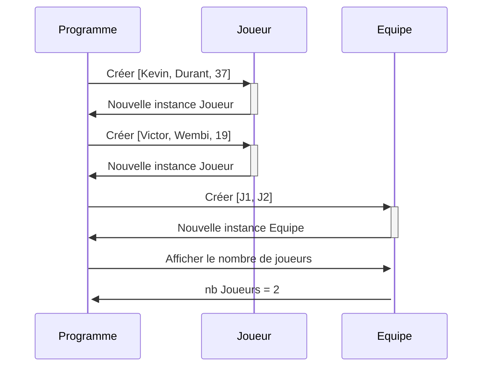
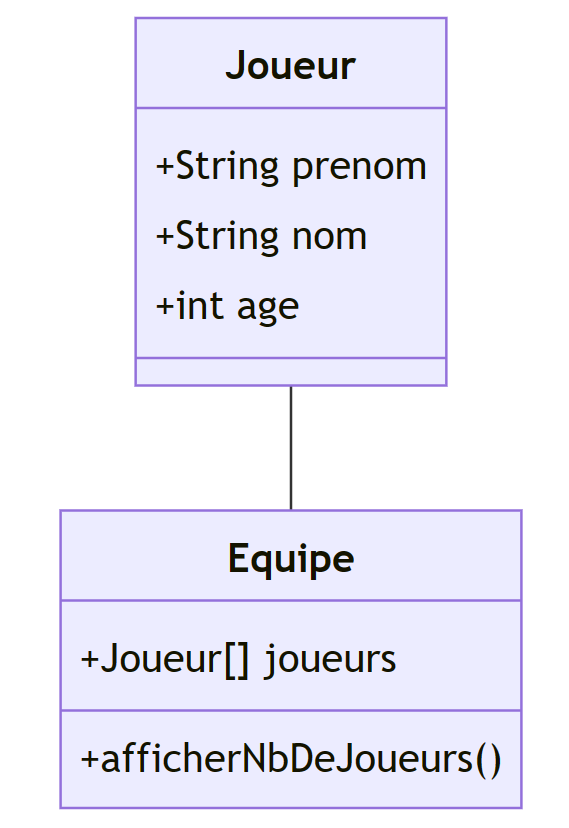
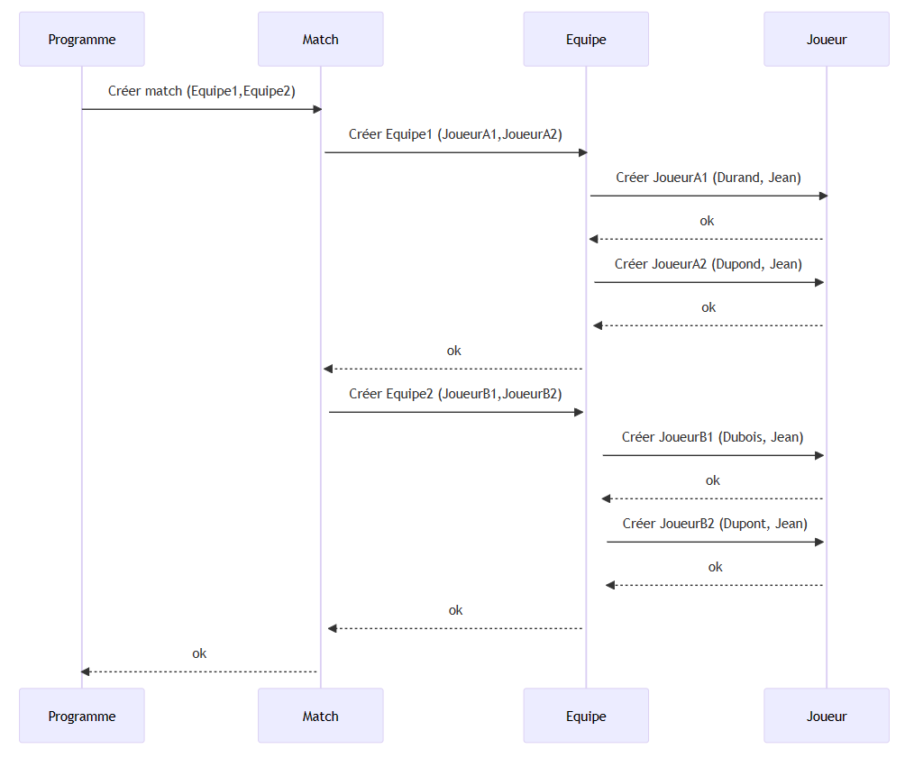
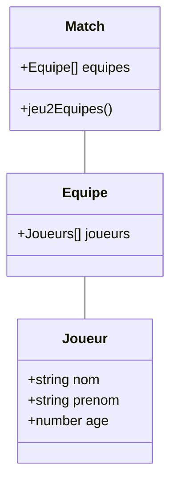
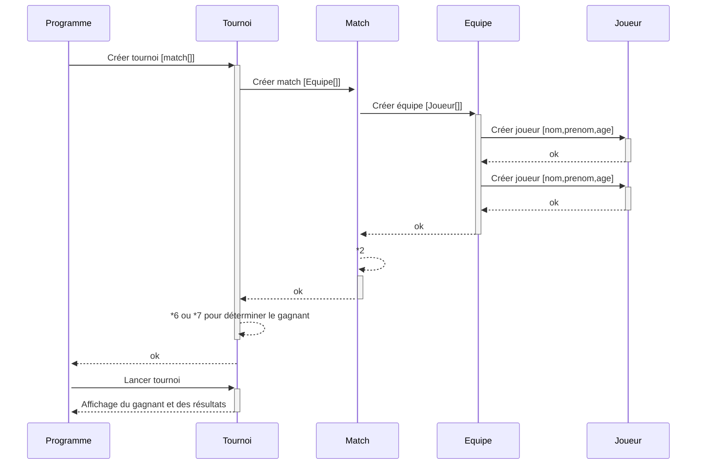

# Exo basket

## Consigne



## Solution



```ts
class Joueur {
    public prenom : string
    public nom : string
    public age : number
    constructor(prenom:string,nom:string,age:number) {
        this.prenom=prenom
        this.nom=nom
        this.age=age
    }
}

class Equipe {
    public joueurs:Joueur[]
    constructor(joueurs:Joueur[]) {
        this.joueurs=joueurs
    }
    public afficherNbJoueurs(){
        console.log("le nombre de joueurs est : "+this.joueurs.length);
    }
}

const joueur1 = new Joueur("Kévin","Durant",37);
const joueur2 = new Joueur("Victor","Wembi",19);

const team = new Equipe([joueur1,joueur2]);
team.afficherNbJoueurs();
```
## Consigne

1 - Créer un match de basket entre deux équipes de deux joueurs chacune

## Solution




```ts
class Match {
    public equipes:Equipe[] ;
    constructor(equipes:Equipe[]){
        this.equipes=equipes;
    }
    public jeu2Equipes() {
        let scoreEq1 = 0;
        let scoreEq2 = 0;
        let j=0;
        while (scoreEq1<=20&&scoreEq2<=20) {
            scoreEq1 += Math.floor(Math.random()*4);
            scoreEq2 += Math.floor(Math.random()*4);
        }
        if (scoreEq1>scoreEq2) {
            j=1;
        }
        else if (scoreEq2<scoreEq1) {
            j=2;
        }
        else {
            j=3
        }
        if (j==3) {
            console.log("il y a eu égalité avec le score : "+scoreEq1+" vs "+scoreEq2);
        }
        else {
            console.log("l'équipe "+j+" a gagnée avec le score : "+scoreEq1+" vs "+scoreEq2);
        }
        
        return [[scoreEq1,scoreEq2],j];
    }
}

const joueur1 = new Joueur("Kévin","Durant",37);
const joueur2 = new Joueur("Victor","Wembi",19);
const joueur3 = new Joueur("Jean","Dupont",28);
const joueur4 = new Joueur("Michel","Dupont",27);

const teamA = new Equipe([joueur1,joueur2]);
const teamB = new Equipe([joueur3,joueur4]);
teamA.afficherNbJoueurs();
teamB.afficherNbJoueurs();

const jeu = new Match([teamA,teamB]);
const res = jeu.jeu2Equipes();


```

## Consigne

2 - Créer un tournoi avec 4 équipes

## Solution


```ts
const joueur1 = new Joueur("Kévin","Durant",37);
const joueur2 = new Joueur("Victor","Wembi",19);
const joueur3 = new Joueur("Jean","Dupont",28);
const joueur4 = new Joueur("Michel","Dupont",27);
const joueur5 = new Joueur("j5_prenom","j5_nom", 18);
const joueur6 = new Joueur("j6_prenom","j6_nom", 29);
const joueur7 = new Joueur("j7_prenom","j7_nom", 34);
const joueur8 = new Joueur("j8_prenom","j8_nom", 23);

const teamA = new Equipe([joueur1,joueur2]);
const teamB = new Equipe([joueur3,joueur4]);
const teamC = new Equipe([joueur5,joueur6]);
const teamD = new Equipe([joueur7,joueur8]);
teamA.afficherNbJoueurs();
teamB.afficherNbJoueurs();

const jeuAB = new Match([teamA,teamB]);
console.log("match entre l'équipe A et l'équipe B")
const resAB = jeuAB.jeu2Equipes();
const jeuAC = new Match([teamA,teamC]);
console.log("match entre l'équipe A et l'équipe C")
const resAC = jeuAC.jeu2Equipes();
const jeuAD = new Match([teamA,teamD]);
console.log("match entre l'équipe A et l'équipe D")
const resAD = jeuAD.jeu2Equipes();
const jeuBC = new Match([teamB,teamC]);
console.log("match entre l'équipe B et l'équipe C")
const resBC = jeuBC.jeu2Equipes();
const jeuBD = new Match([teamB,teamD]);
console.log("match entre l'équipe B et l'équipe D")
const resBD = jeuBD.jeu2Equipes();
const jeuCD = new Match([teamC,teamD]);
console.log("match entre l'équipe C et l'équipe D")
const resCD = jeuCD.jeu2Equipes();

let resA = 0;
let resB = 0;
let resC = 0;
let resD = 0;
// 3 points pour une victoire, 1 pour un match nul
if (resAB[1] == 1) {
    resA+=3;
}
else if (resAB[1] == 3) {
    resA+=1;
    resB+=1;
}
else if (resAB[1] == 2) {
    resB+=3
}
if (resAC[1] == 1) {
    resA+=3;
}
else if (resAC[1] == 3) {
    resA+=1;
    resB+=1;
}
else if (resAC[1] == 2) {
    resB+=3;
}
if (resAD[1] == 1) {
    resA+=3;
}
else if (resAD[1] == 3) {
    resA+=1;
    resD+=1;
}
else if (resAD[1] == 2) {
    resD+=3;
}
if (resBC[1] == 1) {
    resB+=3;
}
else if (resBC[1] == 3) {
    resB+=1;
    resC+=1;
    
}
else if (resBC[1] == 2) {
    resC+=3;
}
if (resBD[1] == 1) {
    resB+=3;
}
else if (resBD[1] == 3) {
    resB+=1;
    resD+=1;
    
}
else if (resBD[1] == 2) {
    resD+=3;
}
if (resCD[1] == 1) {
    resC+=3;
}
else if (resCD[1] == 3) {
    resB+=1;
    resD+=1;
}
else if (resBD[1] == 2) {
    resD+=3;
}

const max = Math.max(resA,resB,resC,resD);
let jeuFinale = new Match([]);
if (resA==max) {
    if (resB==max) {
        jeuFinale.equipes=[teamA,teamB]
        console.log("Il y a égalité entre les équipes A et B et le résultat de la finale est : ")
        let resFinale = jeuFinale.jeu2Equipes();
    }
    else if (resC==max) {
        jeuFinale.equipes=[teamA,teamC]
        console.log("Il y a égalité entre les équipes A et C et le résultat de la finale est : ")
        let resFinale = jeuFinale.jeu2Equipes();
    }
    else if (resD==max) {
        jeuFinale.equipes=[teamA,teamD]
        console.log("Il y a égalité entre les équipes A et D et le résultat de la finale est : ")
        let resFinale = jeuFinale.jeu2Equipes();
    }
    else {
        console.log("l'équipe A a gagne le tournoi")
    }
}
else if (resB==max) {
    if (resC==max) {
        jeuFinale.equipes=[teamB,teamC]
        console.log("Il y a égalité entre les équipes B et C et le résultat de la finale est : ")
        let resFinale = jeuFinale.jeu2Equipes();
    }
    else if (resD==max) {
        jeuFinale.equipes=[teamB,teamD]
        console.log("Il y a égalité entre les équipes B et D et le résultat de la finale est : ")
        let resFinale = jeuFinale.jeu2Equipes();
    }
    else {
        console.log("l'équipe B a gagne le tournoi")
    }
}
else if (resC==max) {
    if (resD==max) {
        jeuFinale.equipes=[teamC,teamD]
        console.log("Il y a égalité entre les équipes C et D et le résultat de la finale est : ")
        let resFinale = jeuFinale.jeu2Equipes();
    }
    else {
        console.log("l'équipe C a gagne le tournoi")
    }
}
else if (resD==max) {
    console.log("l'équipe  D a gagne le tournoi")
}
```